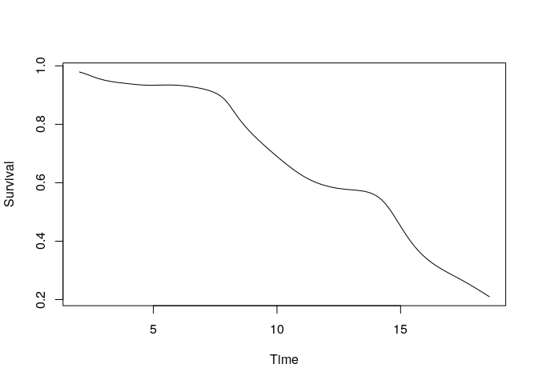
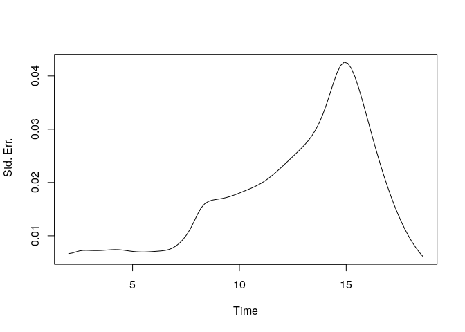

SCORNET
================

<!-- badges: start -->

[](https://github.com/celehs/SCORNET/actions)
<!-- badges: end -->

## Overview

The Semi-supervised Calibration of Risk with Noisy Event Times (SCORNET)
is a consistent, semi-supervised, non-parametric survival curve
estimator optimized for efficient use of Electronic Health Record (EHR)
data with a limited number of current status labels. Derived from van
der Laan and Robins’ Inverse Probability of Censoring Weighted (IPCW)
estimator, it achieves locally efficient survival curve estimation using
current status labels – binary indicators of phenotype status at
censoring time – rather than more expensive event time labels. SCORNET
boosts efficiency over IPCW in the typical EHR setting by (1) utilizing
unlabeled patients in a semi-supervised fashion, and (2) leveraging
information-dense engineered EHR features to maximize imputation
precision in the unlabeled set.

See Ahuja et al. (2020) for details.

## References

  - Ahuja Y, Liang L, Huang S, Cai T (2020). Semi-supervised Calibration
    of Risk with Noisy Event Times (SCORNET) Using Electronic Health
    Record Data. BioArxiv.

  - Mark J. van der Laan & James M. Robins (1998) Locally Efficient
    Estimation with Current Status Data and Time-Dependent Covariates,
    Journal of the American Statistical Association, 93:442, 693-701,
    DOI: 10.1080/01621459.1998.10473721

## SCORNET Example

``` r
library(SCORNET)
```

``` r
sim <- function(N) {
  dat <- data.frame('ID' = 1:N)
  dat$Z0 <- runif(N, -1, 1)
  dat$C <- 10 * (rexp(N) * exp(-0.75 * dat$Z))^(2/3)
  dat$T <- 15 * (rexp(N) * exp(-0.75 * dat$Z))^(2/5)
  dat$X <- pmin(dat$T, dat$C)
  dat$Delta <- dat$T <= dat$C
  dat$filter <- as.logical(
    rbinom(N, 1, 0.98) * dat$Delta + 
      rbinom(N, 1, 0.12) * (1 - dat$Delta))
  dat$Zehr <- pmin(dat$T + rnorm(N, 0, 2), dat$C)
  return(dat)
}
```

``` r
set.seed(1)
N <- 5000
n <- 200
dat <- sim(N)
t0.all <- seq(
  quantile(dat$C, .1),
  quantile(dat$C, .9),
  length.out = 100)
```

``` r
suppressWarnings(scornet_est <- scornet(
  dat$Delta[1:n],
  dat$C[1:n],
  t0.all,
  dat$C[-c(1:n)],
  dat$filter[1:n],
  dat$filter[-c(1:n)],
  dat$Z0[1:n],
  dat$Z0[-c(1:n)],
  dat$Zehr[1:n],
  dat$Zehr[-c(1:n)]))
```

``` r
plot(t0.all, scornet_est$S_hat, 
     type = 'l', xlab = 'Time', ylab = 'Survival')
```

<!-- -->

``` r
plot(t0.all, scornet_est$StdErrs, 
     type = 'l', xlab = 'Time', ylab =' Std. Err.')
```

<!-- -->

``` r
proc.time()
```

    ##    user  system elapsed 
    ##  67.622   0.191  67.823
